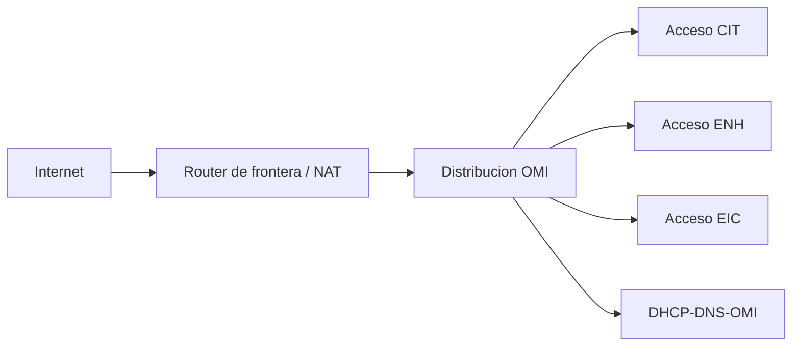

# Arquitectura de red

## Segmentacion

| VLAN | Segmento | Subred | Gateway propuesto | Hosts utiles |
| ---: | --- | --- | --- | ---: |
| Acceso en router Alumnos | Concursantes | `172.23.24.0/23` | `172.23.24.1` | 510 |
| 40 | Invitados | `172.23.26.0/23` | `172.23.26.1` | 510 |
| 10 | Jueces | `172.23.28.0/27` | `172.23.28.1` | 30 |
| 20 | Entrenadores | `172.23.28.64/26` | `172.23.28.65` | 62 |
| 30 | Prensa | `172.23.28.128/26` | `172.23.28.129` | 62 |
| 60 | Infraestructura | `172.23.28.192/27` | `172.23.28.193` | 30 |
| 70 | Servidores | `172.23.28.224/29` | `172.23.28.225` | 6 |
| No aplica | Transito Alumnos-Frontera | `172.23.28.232/30` | No aplica | 2 |

Servidor `DHCP-DNS-OMI`: `172.23.28.226/29`.

## Topologia propuesta

## Politicas minimas

| Origen | DNS/DHCP | Internet | Otros segmentos |
| --- | --- | --- | --- |
| Concursantes | Permitido | Segun evento | Denegado salvo servicios autorizados |
| Jueces | Permitido | Permitido | Acceso administrativo autorizado |
| Entrenadores | Permitido | Permitido | Denegado a concursantes |
| Prensa | Permitido | Permitido | Denegado |
| Invitados | Permitido | Permitido | Denegado |
| Infraestructura | Permitido | Restringido | Administracion autorizada |

## Nota de implementacion

La topologia final conserva las VLAN existentes 10 a 40 y fue migrada al bloque
`172.23.24.0/21`. La configuracion aplicada vive en
`configuracion/packet-tracer/` y documenta nombres, VLAN, pools DHCP,
subinterfaces, rutas, NAT y aislamiento.
